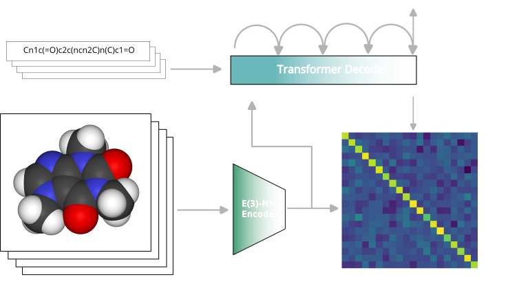

# COATI: multi-modal contrastive pre-training for representing and traversing chemical space



# Overview

COATI (Contrastive Optimization for Accelerated Therapeutic Inference) is a pre-trained, multi-modal encoder-decoder model of druglike chemical space. COATI is constructed without any human biasing of features, using contrastive learning from text and 3D representations of molecules to allow downstream use with structural models. COATI possesses many of the desired properties of a universal molecular embedding: fixed-dimension, invertibility, autoencoding, accurate regression, and low computation cost. 

COATI can also be used in a metadynamics algorithm for generative optimization for designing molecules that satisfy the multi-parameter optimization task of potency, solubility, and druglikeness.

# Installation

Before installation, we recommend to first setup a Python virtual environment.

```bash
$ git clone https://github.com/terraytherapeutics/COATI.git
$ cd COATI
$ pip install .
```

# Examples

- Basic molecule generation: `examples/simple_mol_generation/generation_examples.ipynb`.
- [DUE model](https://arxiv.org/abs/2102.11409) regression: `examples/simple_mol_generation/due_model_regression.ipynb`.
- Molecule generation analysis with Chembl dataset: `examples/simple_mol_generation/chembl_analysis.ipynb`.
- Metadynamics approach to molecular design: `examples/metadynamics/metadynamics.ipynb`.

# Models in the paper

The various models in the paper can be initialied using, e.g.,
```
from coati.models.io import load_e3gnn_smiles_clip_e2e

encoder, tokenizer = load_e3gnn_smiles_clip_e2e(
    freeze=True,
    device=torch.device("cuda:0"),
    # model parameters to load.
    doc_url=<model path>,
)
```
where we provide the following models (`doc_url`) with labels corresponding to their description in the paper:
(recommended grande_closed)
```
s3://terray-public/models/tall_closed.pkl
s3://terray-public/models/grande_closed.pkl
s3://terray-public/models/grade_closed_fp.pkl
s3://terray-public/models/barlow_closed_fp.pkl
s3://terray-public/models/barlow_closed.pkl
s3://terray-public/models/autoreg_only.pkl
s3://terray-public/models/barlow_venti.pkl
s3://terray-public/models/grande_open.pkl
s3://terray-public/models/selfies_barlow.pkl
```

# Datasets

Processed versions of public ADMET datasets with embeddings are made available:
```
s3://terray-public/datasets/ames.pkl
s3://terray-public/datasets/bace_classification.pkl
s3://terray-public/datasets/bace_regression.pkl
s3://terray-public/datasets/bioavailability_ma.pkl
s3://terray-public/datasets/caco2_wang.pkl
s3://terray-public/datasets/chembl_canonical_smiles.pkl
s3://terray-public/datasets/clearance_hepatocyte_az.pkl
s3://terray-public/datasets/clearance_microsome_az.pkl
s3://terray-public/datasets/clintox.pkl
s3://terray-public/datasets/cyp1a2_veith.pkl
s3://terray-public/datasets/cyp2c19_veith.pkl
s3://terray-public/datasets/cyp2c9_veith.pkl
s3://terray-public/datasets/cyp2d6_veith.pkl
s3://terray-public/datasets/cyp3a4_veith.pkl
s3://terray-public/datasets/delaney.pkl
s3://terray-public/datasets/dili.pkl
s3://terray-public/datasets/half_life_obach.pkl
s3://terray-public/datasets/herg.pkl
s3://terray-public/datasets/herg_inhib.pkl
s3://terray-public/datasets/herg_karim.pkl
s3://terray-public/datasets/hia_hou.pkl
s3://terray-public/datasets/hiv.pkl
s3://terray-public/datasets/ld50_zhu.pkl
s3://terray-public/datasets/lipophilicity_astrazeneca.pkl
s3://terray-public/datasets/pampa_ncats.pkl
s3://terray-public/datasets/pgp_broccatelli.pkl
s3://terray-public/datasets/ppbr_az.pkl
s3://terray-public/datasets/solubility_aqsoldb.pkl
s3://terray-public/datasets/tox21.pkl
s3://terray-public/datasets/vdss_lombardo.pkl
```

These can be retrieved e.g. via
```python
import pickle
from coati.common.s3 import download_from_s3

download_from_s3("s3://terray-public/datasets/delaney.pkl")

# datasets are available as pickle files (list of dictionaries)
with open("./datasets/delaney.pkl", "rb") as f:
    delaney = pickle.load(f)

delaney[0].keys()
```

# Cite

If you use COATI in your research, please cite our paper: [COATI: multi-modal contrastive pre-training for representing and traversing chemical space](https://doi.org/10.26434/chemrxiv-2023-bdkgm).
